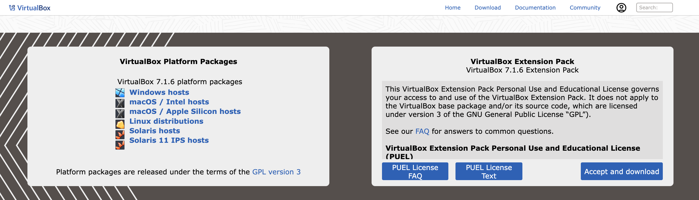
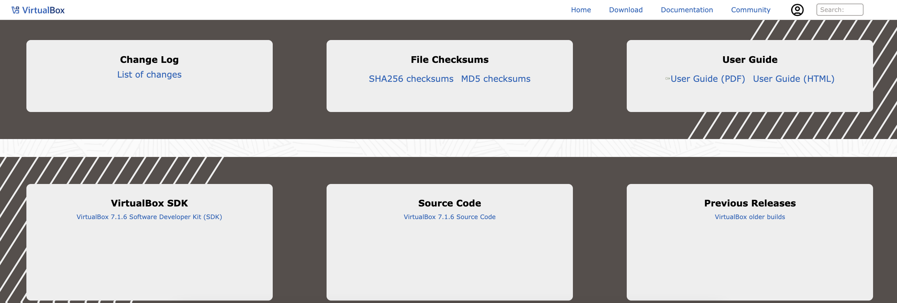
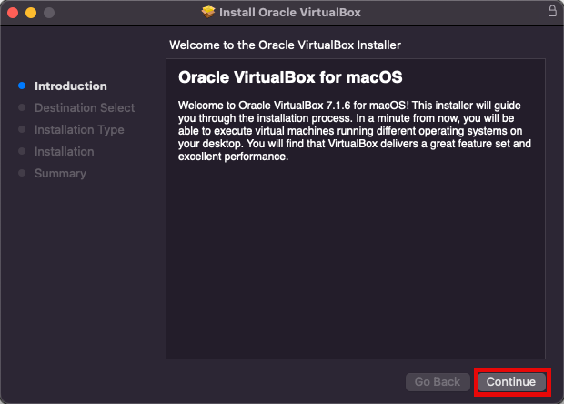
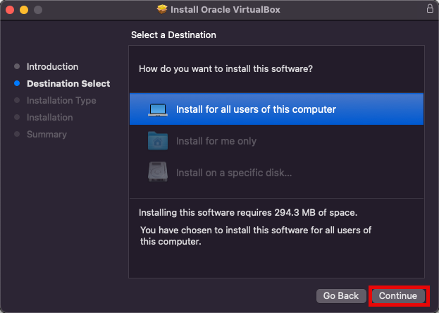
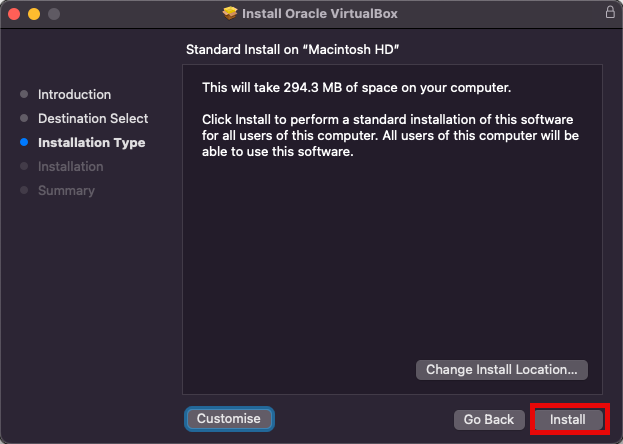
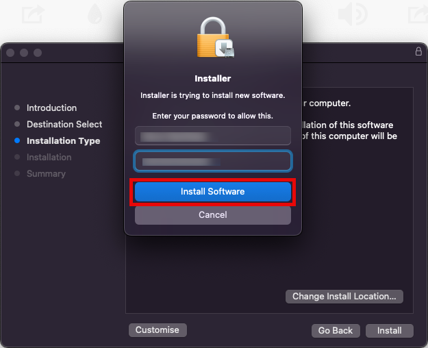
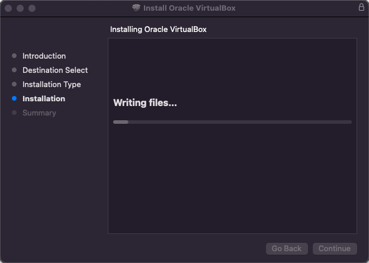
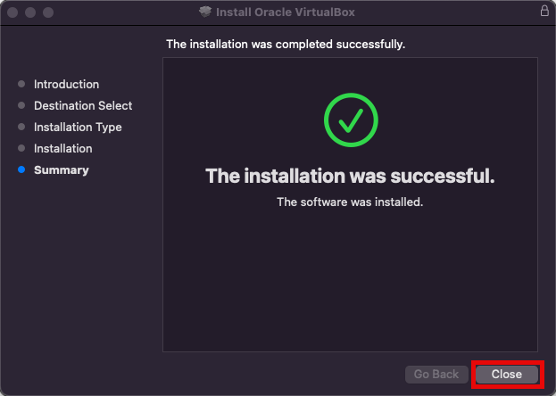
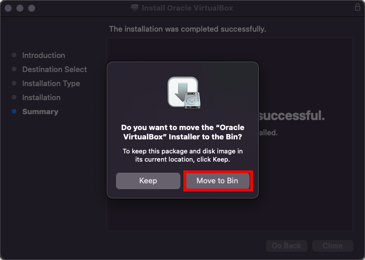

# VirtualBox installation guide

## Overview

VirtualBox is a virtualization software for running multiple virtual machines (VMs) on your computer, at the same time. For example, you can run Windows 10, Ubuntu, and Kali Linux on your Windows 11 machine. You even can run Windows Server and Linux Server on your machine. Within the disk space and memory limits, you can run as many VMs as you need. VirtualBox is easy to use yet powerful in performance. 

## Supported operating system and hardware

You can run VirtualBox on the following host operating systems (OS):
- __x86-64 Windows__
  - Windows 11
  - Windows 10
  - Windows Server 2025
  - Windows Server 2022
- __x86-64 macOS__
  - 14 (Sonoma)
  - 13 (Ventura)
  - 12 (Monterey)
  - 11 (Big Sur)
- __x86-64 Linux__
  - _Ubuntu_
    - 24.04 LTS
    - 22.04 LTS
    - 20.04 LTS
  - _Debian_
    - 12 (Bookworm)
    - 11 (Bullseye)
  - _Red Hat Enterprise Linux_
    - 9
    - 8
  - _Fedora_
    - 41
    - 40
  - _SUSE Linux Enterprise server_ 
    - 15
To run the application smoothly, Intel host CPUs must have __SSE2__ (Streaming SIMD Extensions 2).

## Prerequisite

* Before installing VirtualBox, you need to enable _hardware virtualization_ feature on your CPU such as __Intel VT-X__ or __AMD-V in UEFI/BIOS__ of your host machine. Otherwise, when you try to run 64-bit guest OSs, you can get the error: __VT-x is not available__. 
* When you are using a Windows machine, you need to uninstall __Hyper-V__ before installing VirtualBox. Otherwise, __Hyper-V__ could block hardware virtualization extensions required by VirtualBox to run VMs.

## Download VirtualBox

Go to [Download VirtualBox](https://www.virtualbox.org/wiki/Downloads) page to download the VirtualBox installer. At the moment of writing this installation guide, the latest VirtualBox version is _7.1.6_. You can choose the compatible package for your OS. 
  

You can also download older versions by clicking _VirtualBox older builds_ link in __Previous Releases__ section.

## Steps to install and configure

### For MacOS (Intel chip)

1. To install VirtualBox, double-click the downloaded package installer.
   The _Install Oracle VirtualBox_ wizard appears.
2. Click __Continue__ to proceed further.  
   
   
3. Choose a suitable option from __Destination Select__ section and click __Continue__. 
   
4. Next, choose either standard installation or click __Customise__ button to configure your own installation type in the __Installation Type__ section. Click __Install__ to proceed further.  
   
   
   The __Installer__ dialog box appears. 
5. Enter your machine's login credentials and then click __Install Software__ to start the installation.
   
   The installation process starts.  

   
6. After the completion of installation, the __Summary__ section confirms this by showing _The installation was successful._ message. Click __Close__ proceed further.  
   
   
7. A small dialog box appears, asking whether to keep or move the package installer to Bin. Click __Move to Bin__ to remove the installer from file system.  
   
   

